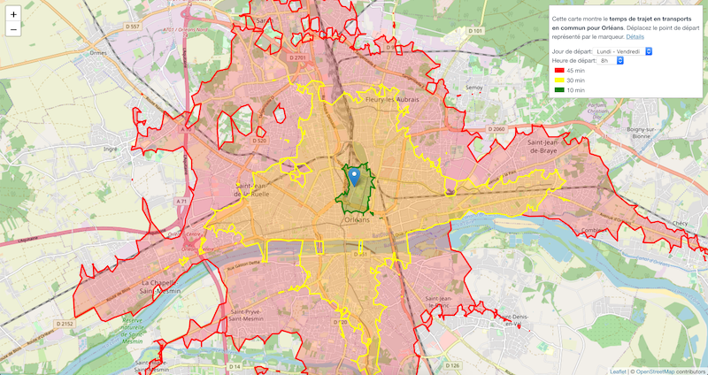

# orleans-isochrone

[Accéder à la démo](https://benjaminhabert.github.io/orleans_isochrone/)



## Informations générales

Cette carte représente le temps de déplacement à Orléans en transports en commun. Par exemple la zone jaune représente un déplacement de 30 minutes ou moins depuis le marqueur bleu. Il est possible de modifier le jour et l'horaire de départ du déplacement.

Le réseau de transport d'Orléans est administré par [Tao](https://www.reseau-tao.fr/index.php?), il comprend **2 lignes de Tram** et **42 lignes de bus**. Nous utilisons les horaires de passages *théoriques* fournis par Tao pour estimer les temps de déplacement (disponibles [ici](https://transport.data.gouv.fr/resources/10221)). Plus précisément nous utilisons les journées suivantes :
 - Jeudi 2 Juillet 2020
 - Samedi 4 Juiller 2020
 - Dimanche 5 Juillet 2020


## Informations techniques

- Sources de données:
    - données GTFS avec les horaires de passage théorique des trams et bus: [transport.data.gouv.fr](https://transport.data.gouv.fr/resources/10221)
    - données cartographiques [openstreetmap](https://download.geofabrik.de/europe/france/centre.html) de la région Centre

- Logiciels
    - [Graphhopper](https://github.com/graphhopper/graphhopper) est utilisé pour analyser les données et produire les courbes isochrones de déplacement
    - Vuejs pour développer le site web

- Inrastructure
    - github-pages pour l'hébergement du site web (statique)
    - AWS EC2 pour héberger le back-end (graphhopper)


# Development information


## Front-end setup

```
git clone https://github.com/BenjaminHabert/orleans_isochrone.git
cd orleans-isochrone/
npm install
npm run serve
npm run lint
npm run build
```

**Note** : the build was slightly modified in `vue.conig.js` to make it compatible with github-pages.

